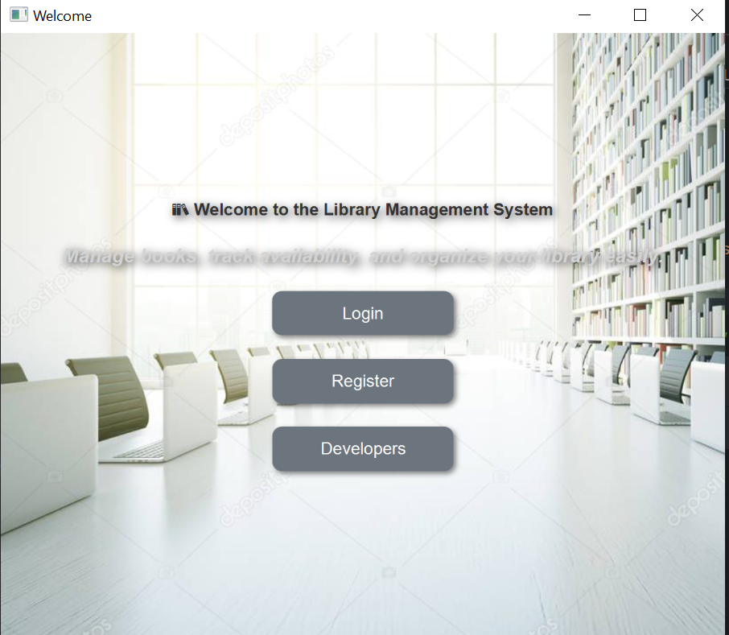
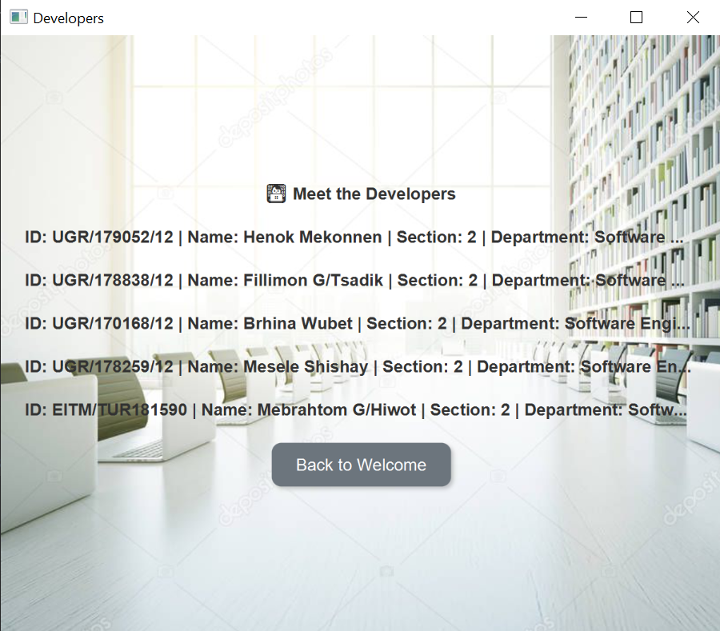
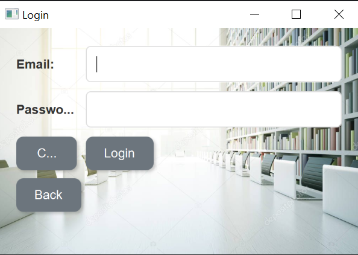
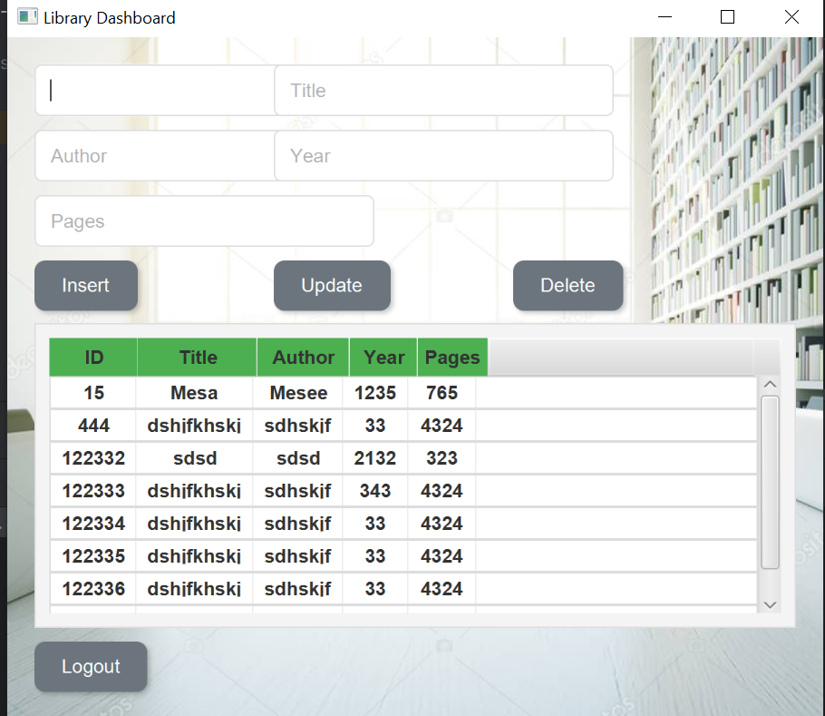

# JavaFX MySQL CRUD Application

A desktop application built with JavaFX that provides CRUD (Create, Read, Update, Delete) operations connected to a MySQL database.

## Features

- **User Authentication**: Secure login and registration system
- **Library Management**: Add, view, update, and delete books in a library database
- **Attractive UI**: Modern user interface with custom styling
- **Welcome Screen**: Initial onboarding experience
- **Developer Information**: About section with developer details

## Screenshots

### Welcome Screen


_The welcome screen with options to login, register, or view developer information_

### Developers Screen


_Information about the application developers_

### Registration Screen


_User registration form for new accounts_

### Login Screen


_Login interface for existing users_

### Library Dashboard


_Main dashboard with book management functionality (Insert, Update, Delete)_

## Technology Stack

- **JavaFX**: For building the desktop UI
- **MySQL**: As the backend database
- **CSS**: For custom styling of UI components

## Project Structure

```
src/
├── application/        # Main application files and UI screens
├── controller/         # Controllers handling business logic
├── library/            # Models and data structures
└── lib/                # External libraries
```

## Setup Instructions

### Prerequisites

- Java Development Kit (JDK) 8 or higher
- MySQL Server
- JavaFX library

### Database Configuration

1. Create a MySQL database
2. Set up the required tables (users, books, etc.)
3. Update the database connection settings in the application

### Database Setup

Use the following SQL script to create the necessary database structure:

```sql
-- Database: `library`

-- Table structure for table `admins`
CREATE TABLE `admins` (
  `id` int(11) NOT NULL,
  `name` varchar(100) DEFAULT NULL,
  `email` varchar(100) DEFAULT NULL,
  `password` varchar(100) DEFAULT NULL
) ENGINE=InnoDB DEFAULT CHARSET=utf8mb4 COLLATE=utf8mb4_general_ci;

-- Table structure for table `books`
CREATE TABLE `books` (
  `Id` int(11) NOT NULL,
  `Title` varchar(255) NOT NULL,
  `Author` varchar(255) NOT NULL,
  `Year` int(11) NOT NULL,
  `Pages` int(11) NOT NULL
) ENGINE=InnoDB DEFAULT CHARSET=utf8mb4 COLLATE=utf8mb4_general_ci;

-- Indexes for table `admins`
ALTER TABLE `admins`
  ADD PRIMARY KEY (`id`),
  ADD UNIQUE KEY `email` (`email`);

-- Indexes for table `books`
ALTER TABLE `books`
  ADD PRIMARY KEY (`Id`);

-- AUTO_INCREMENT for table `admins`
ALTER TABLE `admins`
  MODIFY `id` int(11) NOT NULL AUTO_INCREMENT, AUTO_INCREMENT=1;

-- AUTO_INCREMENT for table `books`
ALTER TABLE `books`
  MODIFY `Id` int(11) NOT NULL AUTO_INCREMENT, AUTO_INCREMENT=1;
```

### Running the Application

1. Clone this repository
2. Open the project in your preferred Java IDE
3. Configure the build path to include JavaFX and MySQL connector libraries
4. Run the `Main.java` file

## Usage Guide

1. Launch the application
2. Register a new account or log in with existing credentials
3. Navigate through the application to manage library items
4. Use the CRUD operations to interact with the database

## Contributing

Contributions are welcome! Please feel free to submit a Pull Request.

## License

This project is licensed under the MIT License - see the LICENSE file for details.

## Acknowledgements

- JavaFX Community
- MySQL Documentation
- Icons and resources used in this project
